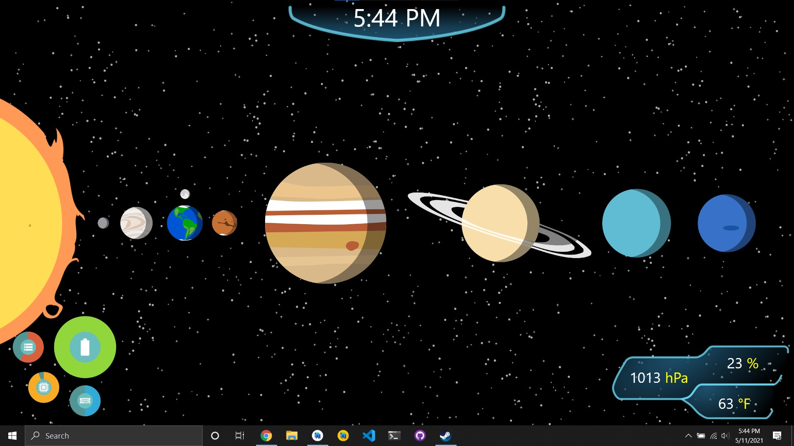

# SubnauticaTheme

A Windows Subnautica theme

## Installation

This will be improved in the future, but here's what I got for now

1. Download the latest installer from the releases pages and run it
2. Run the "Subnautica Theme" from the Windows Start Menu
3. Open the following path in your File Explorer: %APPDATA%\Subnautica Theme
4. Edit the "station.txt" file and enter your station ID (see below)
5. Using either Task Manager or Alt Tab (and close button), close the Subnautica Theme window
6. Run the "Subnautica Theme" from the Windows Start Menu

## How to get your station ID

This app uses the National Weather Service's API to get the current weather conditions (https://www.weather.gov/). You need to enter the station code which can be found by getting your local weather forecast (the 7-Day Forecast view shows it), it will be in the title of the location in parenthesis (ex. KPVD).

## Known Bugs

- Depending on your notification settings, opening your desktop while the theme is running will enable Do Not Disturb mode (because it's fullscreen)

